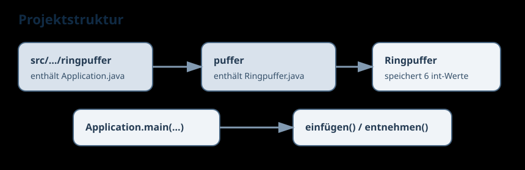

# Ringpuffer Dokumentation

Diese kleine Dokumentation beschreibt den Aufbau des Java-Konsolenprojekts und die Funktionsweise des Ringpuffers.

## Inhalt

- [Dokumentationsindex](./index.md)
- [Projektübersicht](./projektuebersicht.md)
- [Ringpuffer erklärt](./ringpuffer.md)
- [Bauen und Starten](./build-and-run.md)
- [Aufgabenstellung](./aufgabenstellung.md)

## Schnellüberblick

Das Projekt besteht aus zwei zentralen Klassen:

- `Application`: Startpunkt mit `main`
- `Ringpuffer`: Implementierung eines Puffers für genau 6 Ganzzahlen

Eine UML-ähnliche Klassenübersicht findest du ebenfalls in der Projektübersicht.
