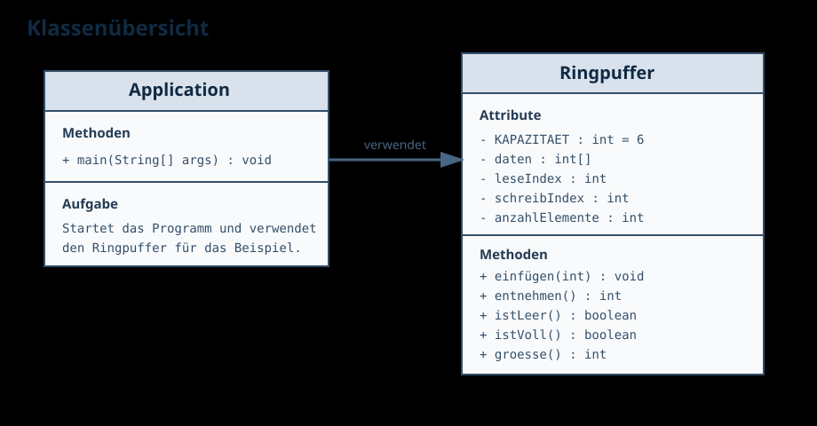

# Dokumentationsindex

Diese Seite fasst die gesamte Dokumentation des Projekts an einer Stelle zusammen.

## Seiten

- [README](./README.md)
- [Projektübersicht](./projektuebersicht.md)
- [Ringpuffer erklärt](./ringpuffer.md)
- [Bauen und Starten](./build-and-run.md)
- [Aufgabenstellung](./aufgabenstellung.md)

## Grafiken

### Projektstruktur

### Klassenübersicht

### Ringpuffer-Aufbau

### Beispielzustand

### Ablaufdiagramm

