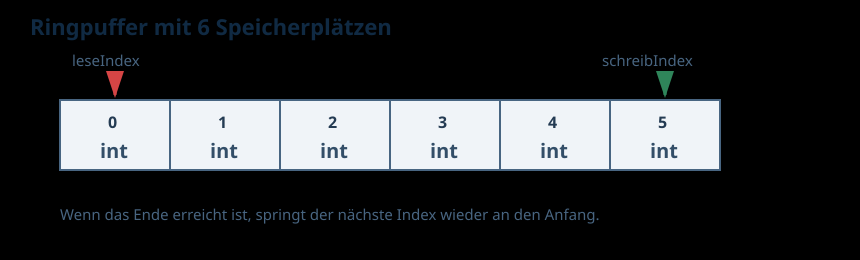
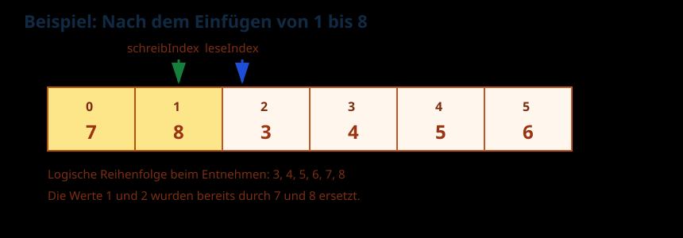
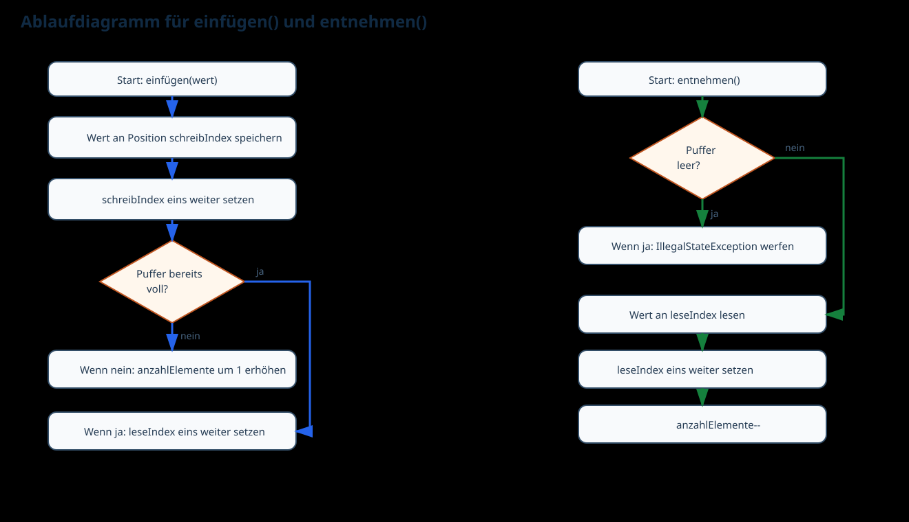

# Ringpuffer erklärt

## Grundidee

Ein Ringpuffer ist ein Speicher mit fester Grösse. Wenn das Ende des Arrays erreicht wird, beginnt der Schreibvorgang wieder vorne.

In diesem Projekt kann der Puffer genau `6` Ganzzahlen aufnehmen.

## Verhalten beim Einfügen

- Solange noch Platz vorhanden ist, wird der neue Wert einfach gespeichert.
- Zuerst wird der neue Wert an der Position `schreibIndex` gespeichert.
- Danach wird `schreibIndex` um eins weitergesetzt.
- War der Puffer vorher noch nicht voll, wird `anzahlElemente` um eins erhöht.
- War der Puffer bereits voll, wird der älteste Wert überschrieben. Dazu wird `leseIndex` um eins weitergesetzt.

## Verhalten beim Entnehmen

- `entnehmen()` liefert immer den ältesten noch vorhandenen Wert.
- Ist der Puffer leer, wird eine `IllegalStateException` ausgelöst.
- Beim erfolgreichen Entnehmen wird der Wert an `leseIndex` gelesen.
- Danach wird `leseIndex` um eins weitergesetzt und `anzahlElemente` um eins verkleinert.

## Beispiel

Werden die Werte `1` bis `8` eingefügt, bleiben am Ende diese 6 Werte im Puffer:

`3 4 5 6 7 8`

Die Werte `1` und `2` wurden überschrieben, weil die Kapazität bereits erreicht war.

Im internen Array liegen die Werte nach diesen acht Einfügevorgängen an den Positionen:

`7 8 3 4 5 6`

Die logische Reihenfolge beim Entnehmen bleibt trotzdem:

`3 4 5 6 7 8`

## Grafiken

### Aufbau

### Beispiel nach 8 Einfügevorgängen

### Ablauf von `einfügen()` und `entnehmen()`

